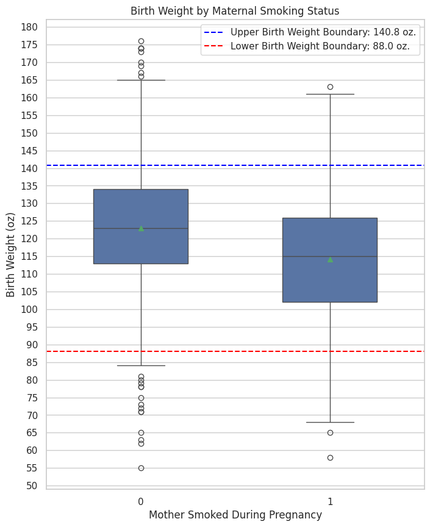
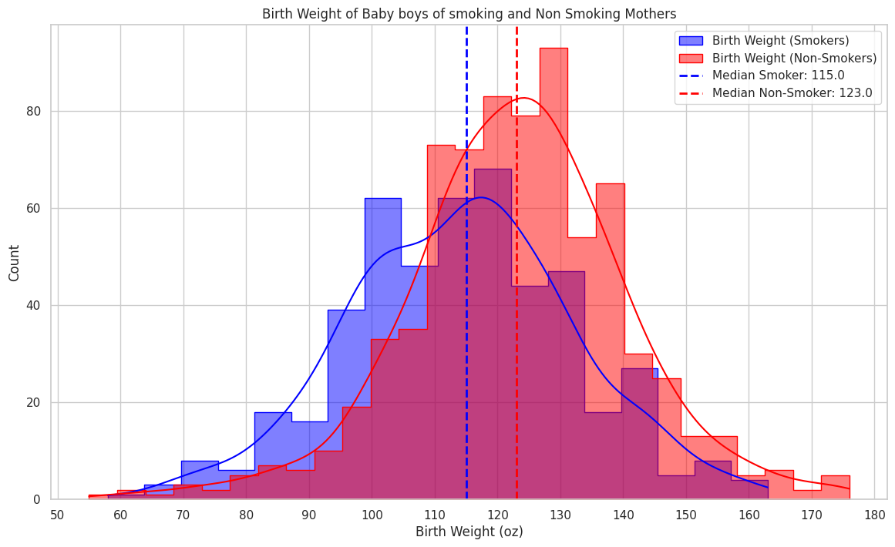

# Investigating the Impact of Maternal Smoking on Neonatal Birth Weight: A Statistical Analysis

[Full Report Here](https://github.com/StevenKinghorn/Maternal-Smoking-and-Infant-Health-Data-Analysis/blob/main/BirthWeight.ipynb)

## Goal
To investigate if there is a statistically significant difference in the birth weights of full-term, singleton baby boys to smoking and non-smoking mothers.
$H_0$: $\mu_NonSmoker = $\mu_Smoker$
$H_1$: $\mu_NonSmoker \ne $\mu_Smoker$
**Test:** Welch’s t-test ($\alpha = 0.05)

## Key Findings
- Null hypothesis rejected ($p<.001$)
- Mean reduction in Birth Weight of the smoking group was **8.9 oz.** (95% CI: 6.9, 11.0)
- Effect Size: Cohen’s d of **0.51**  (95% CI: 0.39, 0.62). The confidence intervals shows a definite moderate effect size in the mean difference of birth weight between groups.

The mean of the non-smoking group is 8.9 oz. (95% CI: 6.9, 11.0) higher than the mean of the smoking group. The confidence intervals do not fall below zero, showing compelling evidence that the difference is robust and unlikely due to mere chance. Blue and red dotted lines indicate the typical weight range for newborns that reach full gestation age [Nol2000] (pp. 3-4). You’ll notice some concerning outliers, especially, in the non-smoking group. The histogram plot below will indicate the magnitude of these outliers.

Birth weight distribution for smoking mothers is bimodal and slightly negatively skewed (skewed left). This bimodal distribution could be caused by the daily amount smoked by mothers. Some mothers may only smoke a little and, therefore, their babies will be born slightly higher weight; those who smoke a lot, will most likely have sons that weigh less at birth (indicated by the left peak). There is also no information on whether the mother stopped smoking during pregnancy - this might lead to higher birth weight.
The medians of both histograms are marked by dotted lines. Even though both distributions markedly overlap, Cohen’s d suggests the means of the two groups differ by about half of a standard deviation: Cohen's d: 0.51, 95% CI: [0.39 0.62]

## Limitations
This report explores a bivariate dataset containing only birth weight and Smoking/Non-Smoking features, therefore, the results of this analysis should be treated with caution.
A more extensive dataset, that include important confounding variables such as maternal age, height, weight, parity, can be found here: https://www.stat.berkeley.edu/users/statlabs/labs.html#babies

## Sources
- This dataset comes from “the Child Health and Development Studies (CHDS) — a comprehensive investigation of all pregnancies that occurred between 1960 and 1967 among women in the Kaiser Foundation Health Plan in the San Francisco–East Bay area [Yer71]
- The dataset, used for this notebook, has been downloaded from: https://www.stat.berkeley.edu/users/statlabs/labs.html#babiesI under the subheading "**Maternal Smoking and Infant Health I**".

## References
- [Nol2000] Nolan, D., & Speed, T. (2000). Stat Labs: Mathematical Statistics Through Applications. New York: Springer.
- [Yer71] J. Yerushalmy. The relationship of parents’ cigarette smoking to outcome of pregnancy—implications as to the problem of inferring causation from observed associations. Am. J. Epidemiol., 93:443–456, 1971.
